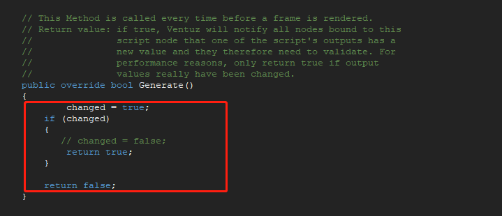

# 如何在VENTUZ下使用C#版的Socketio 
**使用方法**  
    一、新建脚本  
    二、在脚本的左下角References选项卡中 找到PAC Assemblies  点击添加一下三个 dll  dll必须得是4.5 
       
    三、在脚本中需要引入 using Newtonsoft.Json.Linq; using SocketIOClient;  
      
    四、VENTUZ脚本总是出一些奇奇怪怪的 编译错误 例如： await 多余问题 需要手动加上new System.EventHandler 且不支持lamda表达式  dll文件的各种不兼容  
    五、 更新renderer需要 changed = true;  
     
    
```cs 
using System;
using System.Collections;
using System.Collections.Generic;
using System.Linq;
using Ventuz.Kernel;
using Newtonsoft.Json.Linq;
using SocketIOClient;
using System.Threading.Tasks;


public class Script : ScriptBase, System.IDisposable
{
    
    // This member is used by the Validate() method to indicate
    // whether the Generate() method should return true or false
    // during its next execution.
    private bool changed;
    private JToken result;
	public	SocketIO client= new SocketIO("http://127.0.0.1:3000/");
	public string latestMyName = "who";
    public string latestRoom = "X-Art";
	public		JToken res;
	public JToken res2;
   // public	System.Timers.Timer t = new System.Timers.Timer();
   // private	bool init = false;
	
    // This Method is called if the component is loaded/created.
    public Script()
    {
		//client = new SocketIO("http://127.0.0.1:3000/");
        // Note: Accessing input or output properties from this method
        // will have no effect as they have not been allocated yet.
    }
    
    // This Method is called if the component is unloaded/disposed
    public virtual void Dispose()
    {
    }
    
    // This Method is called if an input property has changed its value
  //  public override void Validate()
 //   {
        // Remember: set changed to true if any of the output 
        // properties has been changed, see Generate()
 //   }
    
    // This Method is called every time before a frame is rendered.
    // Return value: if true, Ventuz will notify all nodes bound to this
    //               script node that one of the script's outputs has a
    //               new value and they therefore need to validate. For
    //               performance reasons, only return true if output
    //               values really have been changed.
    public override bool Generate()
    {
		
			changed = true;
        if (changed)
        {
	//				if(init){
	//		t.Interval = 1000;
	//		t.Elapsed += Tick;
	//		t.Start();
	//		init = false;
	//				}
           // changed = false;
			//
            return true;
		}

	


        return false;
	}
	
	
	// This Method is called if an input property has changed its value
	public override void Validate()
	{   
	
		// Remember: set changed to true if any of the output 
		// properties has been changed, see Generate()
		if ((string.IsNullOrEmpty(this.MyName) == false && latestMyName.Equals(this.MyName) == false))
		{
			latestMyName = this.MyName;
			//OnReGetData(-1);
		}	
		if ((string.IsNullOrEmpty(this.Room) == false && latestRoom.Equals(this.Room) == false))
		{
			latestRoom = this.Room;
			//OnReGetData(-1);
		}
	//	else if (isNeedInitData == true)
	//	{
			//OnReGetData(-1);
	//	}
	}
	
	// This Method is called if the function/method Method1 is invoked by the user or a bound event.
	// Return true, if this component has to be revalidated!
	public bool OnConnectHost(int arg)
	{
	//	client = new SocketIO("http://127.0.0.1:3000/");
		client.On("users", response =>
			{
			string text = response.GetValue<string>();
		//	OutPutTest = text;
			});
		client.On("getCameraValue", response =>
			{
			res = response.GetValue();
		//	Alpha = Convert.ToDouble(res.Value<string>("alpha"))*(180/Math.PI) ;
			Alpha = Convert.ToDouble(res.Value<string>("alpha")) *(180/Math.PI)-90;
			Beta = Convert.ToDouble(res.Value<string>("beta"))*(180/Math.PI);
			Radius = Convert.ToDouble(res.Value<string>("radius"))*(0.01d);
			res2 = res.Value<JToken>("target");
			//VLog.Info(res2.Value<string>("x").ToString());

			TargetX  = Convert.ToDouble(res2.Value<string>("x"));
			TargetY  = Convert.ToDouble(res2.Value<string>("y"));
			TargetZ  = Convert.ToDouble(res2.Value<string>("z"));
			
			res2 = res.Value<JToken>("position");
			PositionX =  Convert.ToDouble(res2.Value<string>("x"));
			PositionY =  Convert.ToDouble(res2.Value<string>("y"));
			PositionZ =  Convert.ToDouble(res2.Value<string>("z"));
			
		//	changed = true;
			});
     	
		client.OnPing += Socket_OnPing;
		client.OnPong += Socket_OnPong;
		client.OnConnected += new System.EventHandler(Backval);
		client.ConnectAsync();

		return true;
	}
	public async void Backval(object sender, EventArgs e) {
	
		string jsonstr = @"{'name':'"+latestMyName+"','room':'"+latestRoom+"'}";
	//	OutPutTest = jsonstr;
		await client.EmitAsync("users", new
			{
					home="lates"
			}, "AYU");
		await client.EmitAsync("joinroom", response =>
			{
	
			}, jsonstr);

	}

	private  void Socket_OnPing(object sender, EventArgs e)
	{
		Console.WriteLine("Ping");
	}

	private  void Socket_OnPong(object sender, TimeSpan e)
	{
		Console.WriteLine("Pong: " + e.TotalMilliseconds);
		Latency = e.TotalMilliseconds.ToString();
	}
	public void Tick(object sender, EventArgs e) {
		client.EmitAsync("Ping");
	}
	// This Method is called if the function/method DisconnectHost is invoked by the user or a bound event.
	// Return true, if this component has to be revalidated!
	public bool OnDisconnectHost()
	{
		client.EmitAsync("disconnect", response =>
			{
		//	string text = response.GetValue<string>();
		VLog.Info("disconnect");
			});
		return true;
	}


}

```

**依赖**：  
https://github.com/doghappy/socket.io-client-csharp

**excel 转 json**
```cs 
	 void ParseFile(string excelPath)
	{
		VLog.Info(ExcelURL);
		excelPath = ExcelURL;
		Stream stream = new FileStream(excelPath, FileMode.Open, FileAccess.Read);
		var index = excelPath.LastIndexOf('.');
		var extensionName = excelPath.Substring(index + 1);

		VLog.Info("2");

		var reader = ExcelReaderFactory.CreateOpenXmlReader(stream);
		if(reader == null)
		{
			VLog.Info("文件错误");
			return;
		}

		var dt = reader.AsDataSet();
		dt.AcceptChanges();
		VLog.Info(dt.ToString());
		string json = JsonConvert.SerializeObject(dt, Formatting.Indented);
		VLog.Info(json.ToString());
		JsonStr = json;
	//	if(dt.Tables.Count < 2)
	//	{
//			Console.WriteLine("文件：" + excelPath + " 找不到第二张表");
//			return;
//		}

	//	var table = dt.Tables[1];
	//	var cols = table.Columns.Count;

	//	if(cols <= 1)
	//	{
//			Console.WriteLine("文件：" + excelPath + " 需要至少有两列");
//			return;
//		}

	}


```