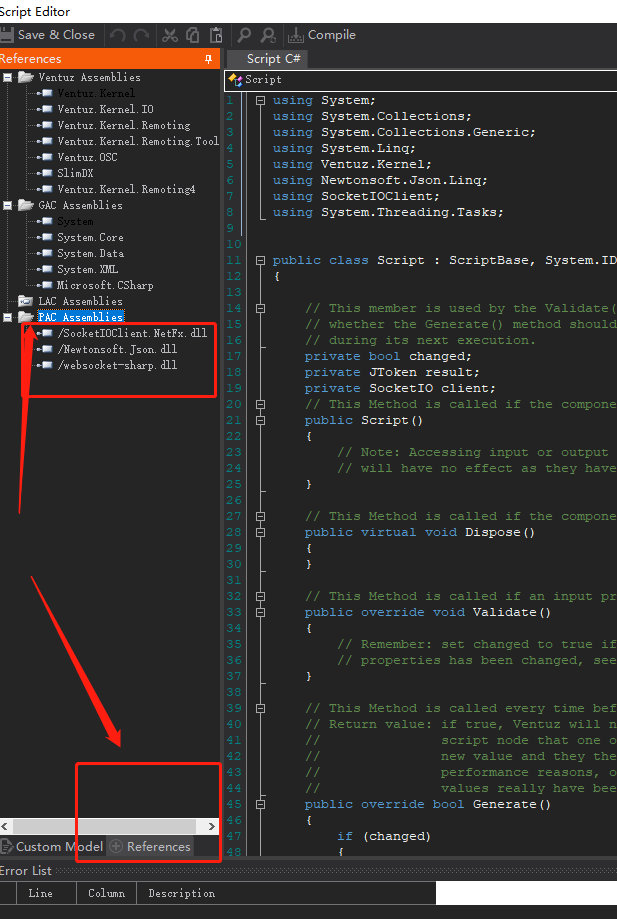
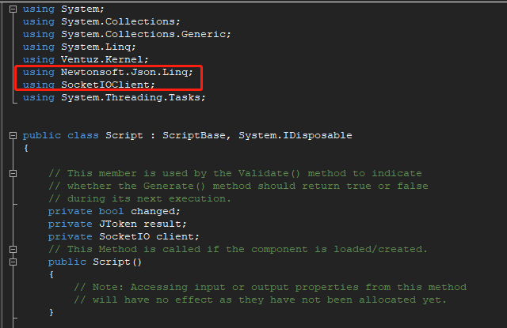

# 如何在VENTUZ下使用C#版的Socketio 
**使用方法**  
    一、新建脚本  
    二、在脚本的左下角References选项卡中 找到PAC Assemblies  点击添加一下三个 dll  
       
    三、在脚本中需要引入 using Newtonsoft.Json.Linq; using SocketIOClient;  
      
    四、VENTUZ脚本总是出一些奇奇怪怪的 编译错误 例如： await 多余问题 需要手动加上new System.EventHandler 且不支持lamda表达式  dll文件的各种不兼容

```cs 
using System;
using System.Collections;
using System.Collections.Generic;
using System.Linq;
using Ventuz.Kernel;
using Newtonsoft.Json.Linq;
using SocketIOClient;
using System.Threading.Tasks;


public class Script : ScriptBase, System.IDisposable
{
    
    // This member is used by the Validate() method to indicate
    // whether the Generate() method should return true or false
    // during its next execution.
    private bool changed;
    private JToken result;
	private	SocketIO client;
    // This Method is called if the component is loaded/created.
    public Script()
    {
        // Note: Accessing input or output properties from this method
        // will have no effect as they have not been allocated yet.
    }
    
    // This Method is called if the component is unloaded/disposed
    public virtual void Dispose()
    {
    }
    
    // This Method is called if an input property has changed its value
    public override void Validate()
    {
        // Remember: set changed to true if any of the output 
        // properties has been changed, see Generate()
    }
    
    // This Method is called every time before a frame is rendered.
    // Return value: if true, Ventuz will notify all nodes bound to this
    //               script node that one of the script's outputs has a
    //               new value and they therefore need to validate. For
    //               performance reasons, only return true if output
    //               values really have been changed.
    public override bool Generate()
    {
        if (changed)
        {
            changed = false;
            return true;
        }

        return false;
	}
	
	// This Method is called if the function/method Method1 is invoked by the user or a bound event.
	// Return true, if this component has to be revalidated!
	public bool OnMethod1(int arg)
	{
		client = new SocketIO("http://127.0.0.1:3000/");
		client.On("users", response =>
			{
			string text = response.GetValue<string>();
			outputStr = text;
			});
		client.OnConnected += new System.EventHandler(Backval);
		client.ConnectAsync();
	//	client = new SocketIO("http://127.0.0.1:3000");
	 //  	client.OnConnected += Backval;
	//	await client.ConnectAsync();
//		Console.WriteLine("hello");
		return false;
	}
	public async void Backval(object sender, EventArgs e) {
		await client.EmitAsync("users", response =>
			{
			result = response.GetValue();
			Console.WriteLine(result);
			}, ".net core");
	}

}
```